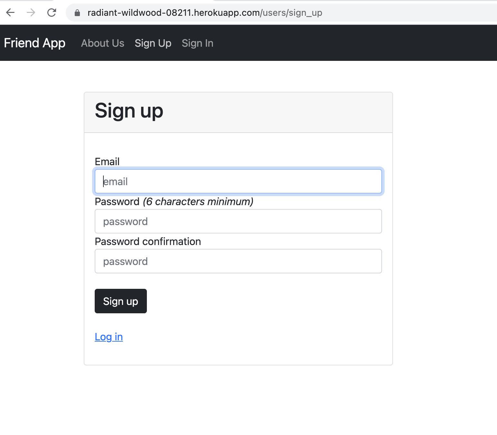
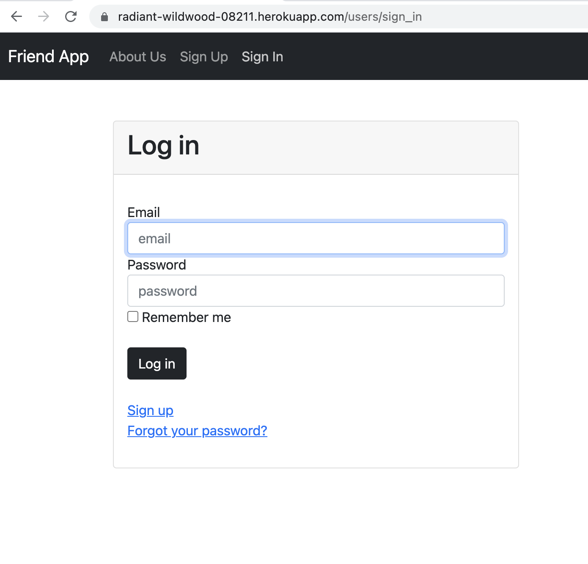
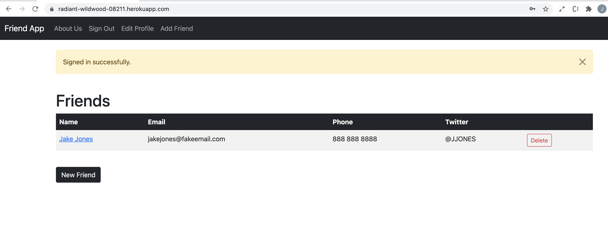
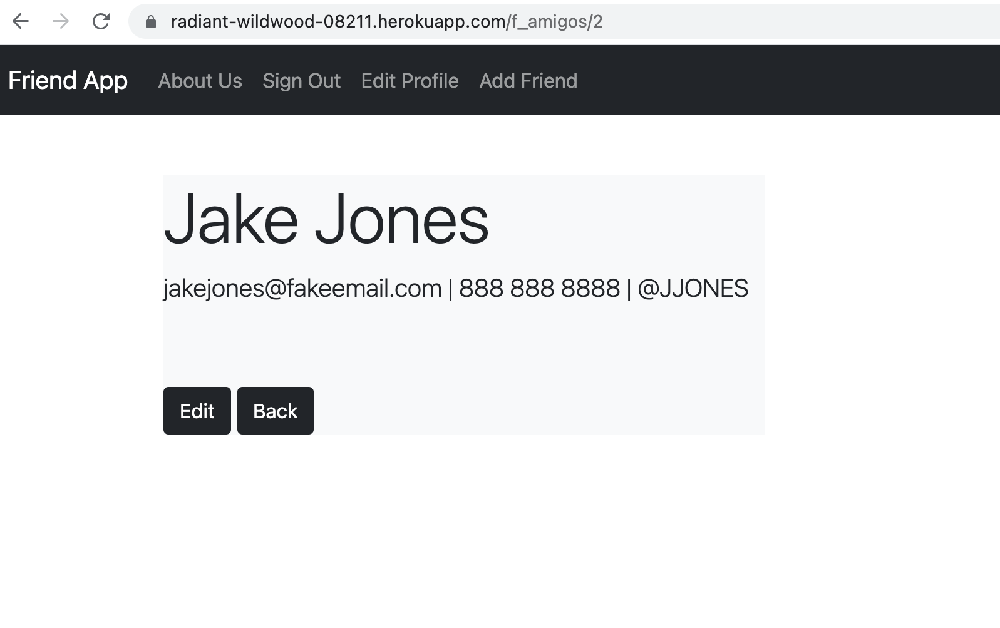
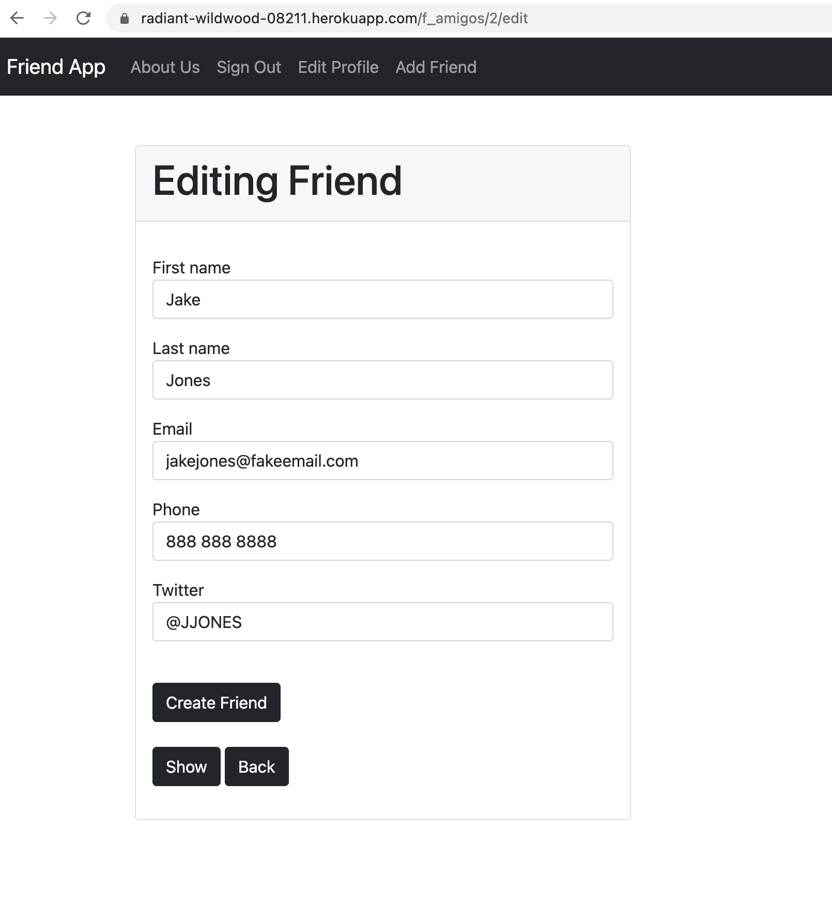
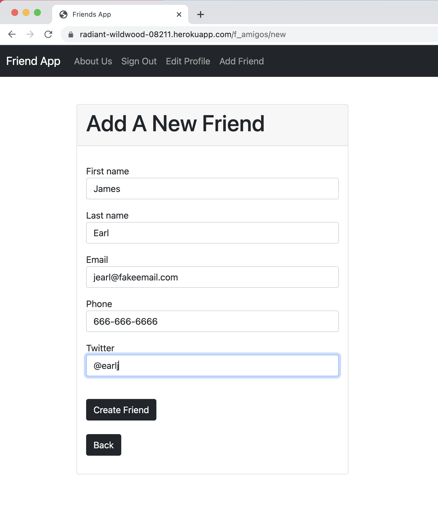
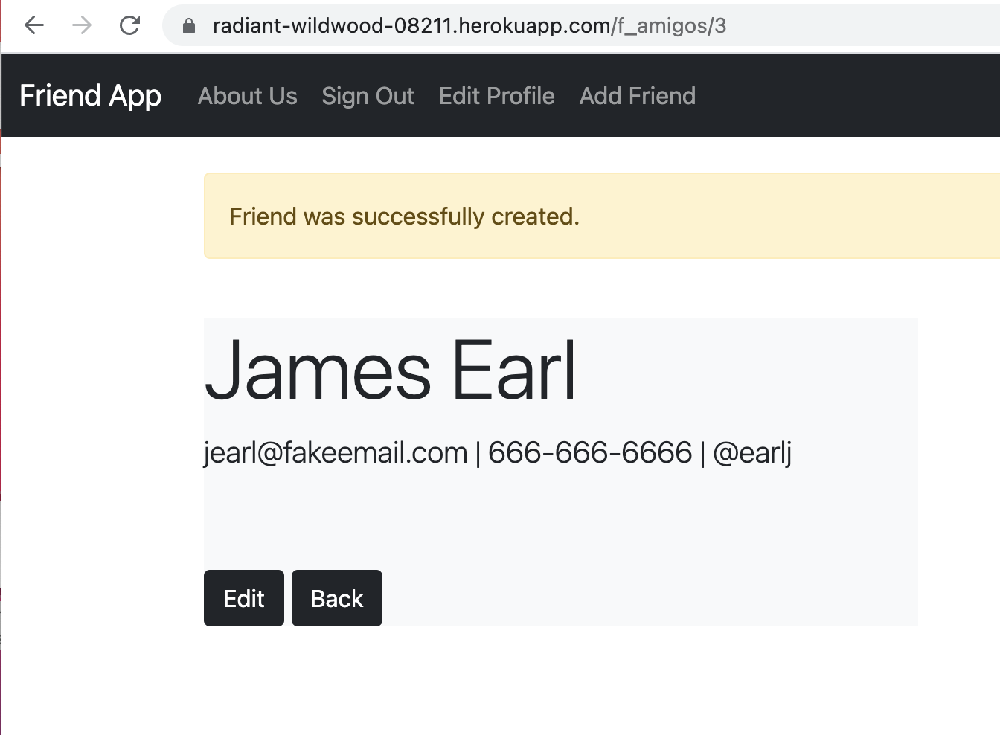
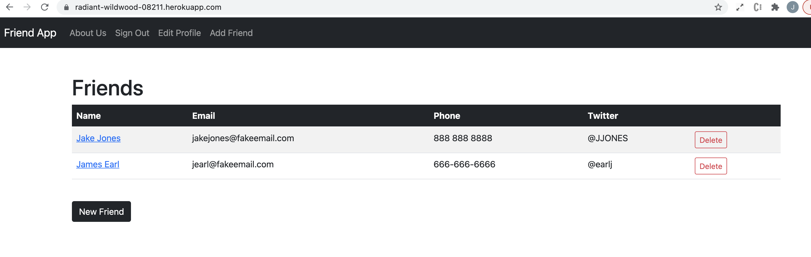

# README

Friends List
===

# DESCRIPTION
---

This project was made following along with a Learn Ruby on Rails course. It is a full CRUD app that allows users
to add friends to a list with their first and last name, email, phone number and twitter. The app also allows the user
to update or delete their friends info.

# TECHNOLOGIES USED
---

- Ruby on Rails
- Bootstrap
- Heroku

# Link
----

Here is a link to the project deployed on heroku.

[Friend App](https://radiant-wildwood-08211.herokuapp.com)

# PHOTOS
====

